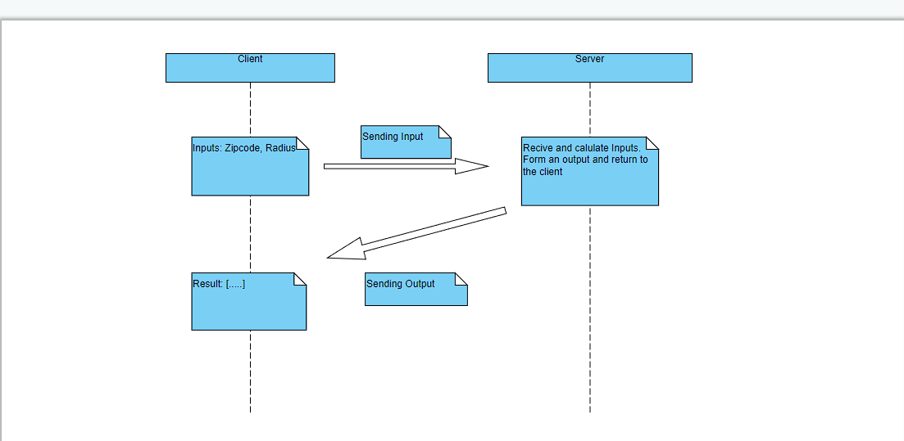

# Zip Code searching Microservice

## Information
This microservice allows a user to input a zip code and a radius distacne to search all the zip code with in the radius distance. Our communication approach uses gRPC which is an API architectural style which will allows end users to call remote methods and services as if they were local objects. In our case, end users will pass a string that represent zipcode and a integer represent the radius distance to our remote zipcode searching via an interface resembling calling a local class method. The zipcode service will then return an list of zipcode to the end user.

## Making a connection with the microservice
### *(Preferred)* Case 1: end user clones this repository
You're all set up!

#### Standing up the microservice
The code necessary to stand up the microservice can be found in the `calc_server.serve()` method. Note the port number the developer has chosen as you will need this on the client/end user side to connect to the microservice.

#### Connecting to the microservice
The code necesarry to instantiate a connection to the microservice can be found in the `client.run()` method.
 - Notice that a default host was selected, if want to switch the host please make adjust on the  `with grpc.insecure_channel('localhost:50052') as channel:` change the `50052` to the host you want
 


## How to request data
To request data, we need to use the servies from the `zip.proto`. We need to provide a `zip_pb2.zipInput()` object to the `zipSearching` services. Which include a zipcode and a radius. Once we created the object, we can use the as the input parameter to the method call. 

Example:
```
//creating an object of type zipInput
response = stub.ZipSearching(zip_pb2.ZipInput(zipCode = zipCodeInput, radius=radiusInput))

//calling the microservice method
 response = stub.ZipSearching(zip_pb2.ZipInput(zipCode = zipCodeInput, radius=radiusInput))
```

## How to receive data
To recice the data, all you need to do it's get the result from the microservice method. In above, the response contain the result of the servies. According to the `zipOutput()` object, the `output` variable contains a string of zipcode that is near the input zipcode.

Example:
```
response = stub.ZipSearching(zip_pb2.ZipInput(zipCode = zipCodeInput, radius=radiusInput))

print(response.output) //expected output: 5

```

## UML diagram

